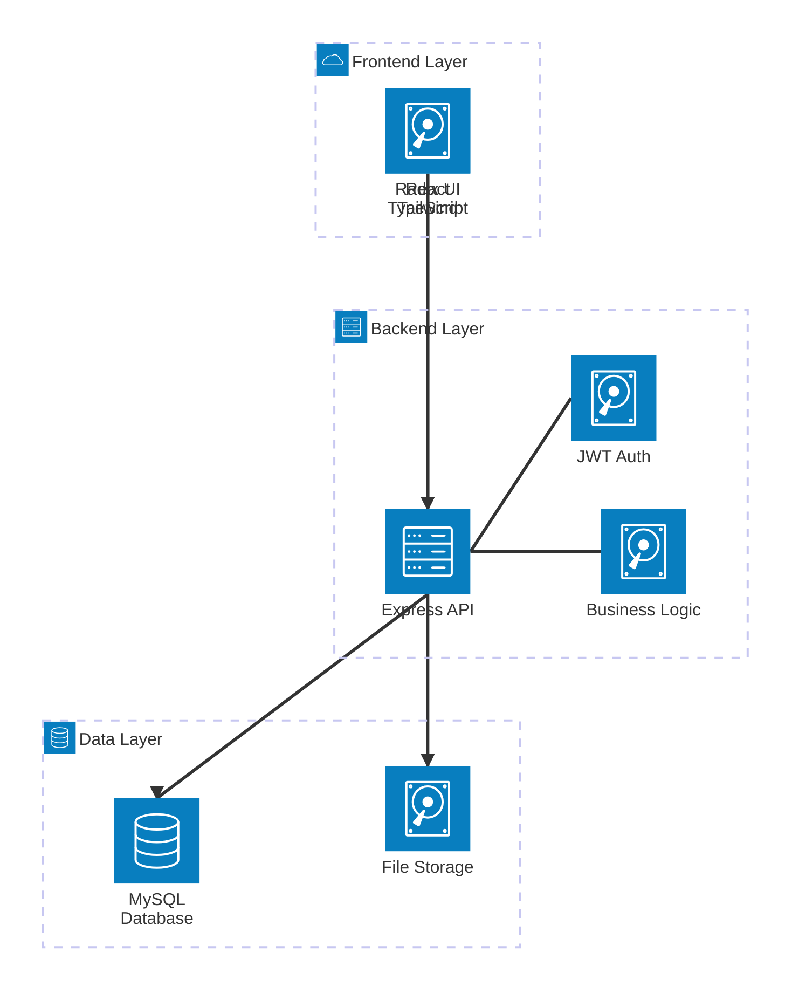
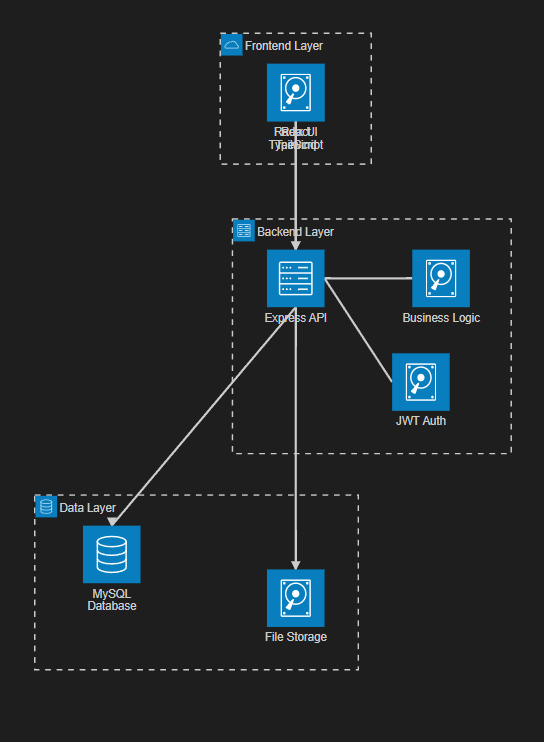

# 🌟 Dayflow - Payroll Management System

A comprehensive, full-stack payroll and HR management system built with modern web technologies. Dayflow streamlines employee attendance tracking, leave management, salary calculation, and payroll processing with an intuitive interface and robust backend.

---

## 📋 Table of Contents

- [Features](#-features)
- [Architecture](#-architecture)
- [Tech Stack](#-tech-stack)
- [Prerequisites](#-prerequisites)
- [Installation](#-installation)
- [Configuration](#-configuration)
- [Usage](#-usage)
- [API Documentation](#-api-documentation)
- [Database Schema](#-database-schema)
- [Project Structure](#-project-structure)
- [Contributing](#-contributing)
- [License](#-license)

---

## ✨ Features

### 👨‍💼 Admin Features
- **Employee Management**
  - Create, update, and manage employee profiles
  - Role-based access control (Admin, HR, Employee)
  - Department and designation management
  - Employee ID auto-generation
  
- **Attendance Tracking**
  - Real-time attendance monitoring
  - Automated work hours calculation
  - Support for multiple attendance statuses (Present, Absent, Half Day, On Duty, Paid Leave, Holiday)
  - Bulk attendance management

- **Leave Management**
  - Approve/reject leave requests
  - Multiple leave types (Sick Leave, Casual Leave, Earned Leave, Unpaid Leave)
  - Leave balance tracking
  - Leave history and audit trail

- **Payroll Processing**
  - Automated salary calculations based on attendance
  - Configurable salary components (Basic, HRA, Allowances, Deductions)
  - Professional Tax (PT) and Provident Fund (PF) management
  - Month-wise payroll generation
  - Salary slip PDF generation

### 👥 Employee Features
- **Personal Dashboard**
  - View attendance history
  - Check salary details and download salary slips
  - Request time-off/leave
  - Update profile information

- **Attendance Management**
  - Check-in/Check-out functionality
  - View work hours and attendance status
  - Monthly attendance summary

- **Leave Application**
  - Submit leave requests with reasons
  - Track leave application status
  - View leave balance and history

- **Salary Details**
  - View detailed salary breakdowns
  - Download monthly salary slips (PDF)
  - Track payment history

### 🔒 Security Features
- JWT-based authentication
- Password encryption with bcrypt
- Role-based authorization (RBAC)
- Secure API endpoints
- CORS configuration
- HTTP security headers with Helmet.js

---

## 🏗️ Architecture



### System Architecture

**Frontend (React + TypeScript)**
- Modern React 18 with TypeScript for type safety
- Radix UI components for accessible UI elements
- Tailwind CSS for responsive design
- Client-side routing with protected routes
- Axios-based API client with interceptors
- LocalStorage for token management

**Backend (Node.js + Express)**
- RESTful API architecture
- JWT-based stateless authentication
- Role-based middleware for authorization
- Service layer pattern for business logic
- Controller-based routing
- Winston logger for application logs
- Multer for file uploads (avatars, documents)

**Database (MySQL)**
- Normalized relational database design
- Foreign key constraints for data integrity
- Indexed queries for performance
- Connection pooling for scalability

**File Management**
- PDF generation using Puppeteer and Handlebars
- Image upload handling (avatars, logos)
- Organized file storage structure

---

## 🛠️ Tech Stack

### Frontend
| Technology | Purpose |
|------------|---------|
| **React 18** | UI Framework |
| **TypeScript** | Type-safe JavaScript |
| **Vite** | Build tool and dev server |
| **Radix UI** | Headless UI components |
| **Tailwind CSS** | Utility-first CSS framework |
| **Lucide React** | Icon library |
| **Axios** | HTTP client |
| **React Hook Form** | Form handling |
| **Recharts** | Data visualization |
| **Sonner** | Toast notifications |

### Backend
| Technology | Purpose |
|------------|---------|
| **Node.js** | Runtime environment |
| **Express.js** | Web framework |
| **MySQL2** | Database driver |
| **JWT** | Authentication |
| **Bcrypt.js** | Password hashing |
| **Winston** | Logging |
| **Helmet** | Security headers |
| **CORS** | Cross-origin resource sharing |
| **Multer** | File upload handling |
| **Puppeteer** | PDF generation |
| **Handlebars** | Template engine |
| **Nodemailer** | Email service |

---

## 📦 Prerequisites

Before you begin, ensure you have the following installed:

- **Node.js** (v16 or higher)
- **npm** or **yarn** package manager
- **MySQL** (v8.0 or higher)
- **Git** (for cloning the repository)

---

## 🚀 Installation

### 1. Clone the Repository

```bash
git clone https://github.com/yourusername/dayflow.git
cd dayflow
```

### 2. Backend Setup

```bash
# Navigate to backend directory
cd backend

# Install dependencies
npm install

# Create .env file
cp .env.example .env

# Configure your environment variables (see Configuration section)

# Initialize the database
mysql -u root -p < database/init.sql

# Optional: Seed admin user
node database/seeds/adminSeed.js
```

### 3. Frontend Setup

```bash
# Navigate to frontend directory
cd ../frontend

# Install dependencies
npm install

# Create .env file
cp .env.example .env

# Configure your environment variables
```

---

## ⚙️ Configuration

### Backend Environment Variables

Create a `.env` file in the `backend` directory:

```env
# Server Configuration
NODE_ENV=development
PORT=5000
FRONTEND_URL=http://localhost:3000

# Database Configuration
DB_HOST=localhost
DB_USER=root
DB_PASSWORD=your_password
DB_NAME=dayflow_db
DB_PORT=3306

# JWT Configuration
JWT_SECRET=your-super-secret-jwt-key-change-in-production
JWT_EXPIRE=7d

# Email Configuration (for notifications)
EMAIL_HOST=smtp.gmail.com
EMAIL_PORT=587
EMAIL_USER=your-email@gmail.com
EMAIL_PASSWORD=your-email-password
EMAIL_FROM=noreply@dayflow.com

# File Upload Configuration
MAX_FILE_SIZE=5242880
ALLOWED_FILE_TYPES=image/jpeg,image/png,image/jpg
```

### Frontend Environment Variables

Create a `.env` file in the `frontend` directory:

```env
VITE_API_BASE_URL=http://localhost:5000
VITE_API_PREFIX=/api
```

### Database Setup

1. **Create the database:**
```bash
mysql -u root -p
CREATE DATABASE dayflow_db;
```

2. **Run the initialization script:**
```bash
mysql -u root -p dayflow_db < backend/database/init.sql
```

3. **Seed admin user (optional):**
```bash
cd backend
node database/seeds/adminSeed.js
```

Default admin credentials:
- **Email:** admin@dayflow.com
- **Password:** admin123 (Change this immediately!)

---

## 💻 Usage

### Starting the Application

#### Development Mode

**Backend:**
```bash
cd backend
npm run dev
```
The API server will start on `http://localhost:5000`

**Frontend:**
```bash
cd frontend
npm run dev
```
The frontend will start on `http://localhost:3000`

#### Production Mode

**Backend:**
```bash
cd backend
npm start
```

**Frontend:**
```bash
cd frontend
npm run build
npm run preview
```

### Accessing the Application

1. Open your browser and navigate to `http://localhost:3000`
2. Sign in with your credentials
3. Explore the dashboard based on your role (Admin/Employee)

---

## 📚 API Documentation

### Authentication Endpoints

| Method | Endpoint | Description | Auth Required |
|--------|----------|-------------|---------------|
| POST | `/api/auth/signup` | Register new user | No |
| POST | `/api/auth/signin` | User login | No |
| GET | `/api/auth/me` | Get current user | Yes |

### Admin Endpoints

| Method | Endpoint | Description | Auth Required |
|--------|----------|-------------|---------------|
| POST | `/api/admin/employees` | Create employee | Admin/HR |
| GET | `/api/admin/employees` | List all employees | Admin/HR |
| GET | `/api/admin/employees/:id` | Get employee details | Admin/HR |
| PUT | `/api/admin/employees/:id` | Update employee | Admin/HR |
| DELETE | `/api/admin/employees/:id` | Delete employee | Admin |
| POST | `/api/admin/attendance` | Mark attendance | Admin/HR |
| GET | `/api/admin/leaves` | View all leave requests | Admin/HR |
| PUT | `/api/admin/leaves/:id` | Approve/Reject leave | Admin/HR |

### Employee Endpoints

| Method | Endpoint | Description | Auth Required |
|--------|----------|-------------|---------------|
| GET | `/api/emp/profile` | Get employee profile | Employee |
| PUT | `/api/emp/profile` | Update profile | Employee |
| GET | `/api/emp/attendance` | View attendance history | Employee |
| POST | `/api/emp/attendance/checkin` | Check in | Employee |
| POST | `/api/emp/attendance/checkout` | Check out | Employee |
| GET | `/api/emp/leaves` | View own leaves | Employee |
| POST | `/api/emp/leaves` | Request leave | Employee |

### Payroll Endpoints

| Method | Endpoint | Description | Auth Required |
|--------|----------|-------------|---------------|
| POST | `/api/payroll/calculate` | Calculate salary | Admin/HR |
| GET | `/api/payroll/:employeeId` | Get payroll records | Admin/HR/Employee |
| GET | `/api/payroll/:employeeId/:month/:year` | Get specific month payroll | Admin/HR/Employee |
| GET | `/api/payroll/slip/:id` | Download salary slip PDF | Admin/HR/Employee |

For detailed API documentation with request/response examples, refer to:
- [`backend/openapi.yaml`](backend/openapi.yaml)
- [`frontend/openapi.yaml`](frontend/openapi.yaml)

---

## 🗄️ Database Schema

### Users Table
Stores employee and admin information.

| Column | Type | Description |
|--------|------|-------------|
| id | VARCHAR(20) | Unique employee ID (PK) |
| firstName | VARCHAR(50) | First name |
| lastName | VARCHAR(50) | Last name |
| email | VARCHAR(100) | Email (unique) |
| password | VARCHAR(255) | Hashed password |
| role | ENUM | admin, hr, employee |
| department | VARCHAR(50) | Department name |
| designation | VARCHAR(50) | Job title |
| joinDate | DATE | Date of joining |
| wage | DECIMAL(10,2) | Gross monthly salary |
| bankAccountNumber | VARCHAR(30) | Bank account |
| avatar | VARCHAR(255) | Profile picture path |
| isActive | BOOLEAN | Account status |

### Attendance Table
Tracks daily attendance records.

| Column | Type | Description |
|--------|------|-------------|
| id | INT | Auto-increment (PK) |
| employeeId | VARCHAR(20) | FK to users.id |
| date | DATE | Attendance date |
| check_in_time | DATETIME | Check-in timestamp |
| check_out_time | DATETIME | Check-out timestamp |
| status | ENUM | Present, Absent, Half Day, etc. |
| work_hours | FLOAT | Calculated work hours |

### Leaves Table
Manages leave applications.

| Column | Type | Description |
|--------|------|-------------|
| id | INT | Auto-increment (PK) |
| employeeId | VARCHAR(20) | FK to users.id |
| leaveType | ENUM | Sick, Casual, Earned, Unpaid |
| startDate | DATE | Leave start date |
| endDate | DATE | Leave end date |
| reason | TEXT | Leave reason |
| status | ENUM | Pending, Approved, Rejected |
| adminResponse | TEXT | Admin's comment |
| reviewedBy | VARCHAR(20) | Reviewer's ID |

### Payrolls Table
Stores monthly salary calculations.

| Column | Type | Description |
|--------|------|-------------|
| id | INT | Auto-increment (PK) |
| employeeId | VARCHAR(20) | FK to users.id |
| month | INT | Month (1-12) |
| year | INT | Year |
| totalDays | INT | Total days in month |
| payableDays | FLOAT | Working days |
| basic | DECIMAL(10,2) | Basic salary |
| hra | DECIMAL(10,2) | House Rent Allowance |
| allowances | DECIMAL(10,2) | Other allowances |
| deductions | DECIMAL(10,2) | Total deductions |
| netSalary | DECIMAL(10,2) | Final salary |
| status | ENUM | Processed, Paid |
| paymentDate | DATE | Payment date |

For complete schema, see [`backend/database/init.sql`](backend/database/init.sql)

---

## 📁 Project Structure

```
dayflow/
├── backend/
│   ├── config/               # Configuration files
│   │   ├── constants.js      # Application constants
│   │   ├── db.config.js      # Database connection
│   │   └── logger.js         # Winston logger setup
│   ├── database/
│   │   ├── init.sql          # Database schema
│   │   └── seeds/            # Database seeders
│   ├── logs/                 # Application logs
│   ├── public/               # Static files
│   │   ├── exports/          # Generated PDFs
│   │   └── uploads/          # User uploads
│   ├── src/
│   │   ├── app.js            # Express app setup
│   │   ├── server.js         # Server entry point
│   │   ├── controllers/      # Route controllers
│   │   ├── middleware/       # Custom middleware
│   │   ├── models/           # Database models
│   │   ├── routes/           # API routes
│   │   ├── services/         # Business logic
│   │   └── utils/            # Helper functions
│   ├── templates/            # Handlebars templates
│   ├── package.json
│   └── openapi.yaml          # API specification
│
├── frontend/
│   ├── src/
│   │   ├── components/       # React components
│   │   │   ├── common/       # Reusable components
│   │   │   ├── figma/        # Design system components
│   │   │   ├── layout/       # Layout components
│   │   │   ├── tables/       # Table components
│   │   │   └── ui/           # UI components (Radix)
│   │   ├── config/           # Frontend configuration
│   │   ├── hooks/            # Custom React hooks
│   │   ├── pages/            # Page components
│   │   ├── services/         # API service layer
│   │   ├── styles/           # Global styles
│   │   ├── types/            # TypeScript types
│   │   ├── utils/            # Utility functions
│   │   ├── App.tsx           # Main app component
│   │   └── main.tsx          # Application entry
│   ├── index.html
│   ├── package.json
│   ├── vite.config.ts        # Vite configuration
│   └── openapi.yaml          # API specification
│
└── README.md                 # This file
```

### Key Backend Modules

**Services:**
- `salaryEngine.js` - Complex salary calculations with PF, PT, HRA, allowances
- `attendanceCalculator.js` - Work hours and payable days calculation
- `pdfService.js` - PDF generation for salary slips
- `idGenerator.js` - Auto-generate employee IDs
- `emailSender.js` - Email notifications

**Middleware:**
- `authMiddleware.js` - JWT verification
- `rbacMiddleware.js` - Role-based access control
- `uploadMiddleware.js` - File upload handling

### Key Frontend Modules

**Services:**
- `api.client.ts` - Axios instance with interceptors
- `auth.service.ts` - Authentication API calls
- `employee.service.ts` - Employee management API
- `payroll.service.ts` - Payroll API calls
- `admin.service.ts` - Admin operations

**Components:**
- `Dashboard.tsx` - Main dashboard (role-based)
- `Attendance.tsx` - Attendance management
- `TimeOffAdmin.tsx` - Leave approval interface
- `SalaryCalculationModal.tsx` - Salary calculation UI
- `CreateEmployeeModal.tsx` - Employee creation form

---

## 🔐 Security Best Practices

1. **Change Default Credentials:**
   - Update the default admin password immediately after first login

2. **Environment Variables:**
   - Never commit `.env` files to version control
   - Use strong, unique values for `JWT_SECRET`

3. **Database Security:**
   - Use strong database passwords
   - Restrict database access to localhost in production
   - Regular backups

4. **File Uploads:**
   - Validate file types and sizes
   - Sanitize file names
   - Store uploads outside the web root

5. **HTTPS:**
   - Use HTTPS in production
   - Configure secure cookie settings

---

## 🧪 Testing

```bash
# Backend tests
cd backend
npm test

# Frontend tests
cd frontend
npm test

# End-to-end tests
npm run test:e2e
```

---

## 📈 Salary Calculation Logic

The system uses the following formula for salary calculation:

### Earnings Breakdown:
- **Basic Salary:** 50% of Gross Wage
- **HRA (House Rent Allowance):** 50% of Basic Salary
- **Standard Allowance:** Fixed ₹4,167
- **Performance Bonus:** 8.33% of Basic Salary
- **LTA (Leave Travel Allowance):** 8.33% of Basic Salary
- **Fixed Allowance:** Balancing component

### Deductions:
- **PF (Provident Fund):** 12% of Basic Salary
- **Professional Tax:** Fixed ₹200

### Net Salary Calculation:
```
Net Salary = (Basic + HRA + Allowances) - (PF + PT + Other Deductions)
```

The payable days are calculated based on actual work hours:
- **Full Day:** ≥ 8 hours
- **Half Day:** 4-8 hours
- **Absent:** < 4 hours

---

## 🤝 Contributing

We welcome contributions! Please follow these steps:

1. **Fork the repository**
2. **Create a feature branch:**
   ```bash
   git checkout -b feature/amazing-feature
   ```
3. **Commit your changes:**
   ```bash
   git commit -m 'Add some amazing feature'
   ```
4. **Push to the branch:**
   ```bash
   git push origin feature/amazing-feature
   ```
5. **Open a Pull Request**

### Coding Standards
- Follow ESLint configuration for JavaScript/TypeScript
- Write meaningful commit messages
- Add comments for complex logic
- Update documentation as needed
- Write tests for new features

---

## 🐛 Known Issues & Roadmap

### Known Issues
- PDF generation may be slow for large datasets
- Mobile responsiveness needs improvement in some areas

### Future Enhancements
- [ ] Real-time notifications with WebSockets
- [ ] Advanced reporting and analytics dashboard
- [ ] Integration with biometric attendance devices
- [ ] Mobile app (React Native)
- [ ] Multi-language support
- [ ] Document management system
- [ ] Performance review module
- [ ] Training and development tracking
- [ ] Expense management
- [ ] Tax calculation and filing assistance

---

## 📞 Support

For issues, questions, or contributions:
- **GitHub Issues:** [Create an issue](https://github.com/yourusername/dayflow/issues)
- **Email:** support@dayflow.com
- **Documentation:** [Wiki](https://github.com/yourusername/dayflow/wiki)

---

## 📄 License

This project is licensed under the MIT License - see the [LICENSE](LICENSE) file for details.

---

## 🙏 Acknowledgments

- **Radix UI** for accessible component primitives
- **Tailwind CSS** for the utility-first CSS framework
- **MySQL** for the robust database system
- **Express.js** for the web framework
- **React** team for the amazing frontend library
- All contributors who have helped shape this project

---

## 📊 Project Stats

- **Total Files:** 100+
- **Lines of Code:** ~15,000+
- **Database Tables:** 4 core tables
- **API Endpoints:** 30+
- **UI Components:** 50+

---

<div align="center">


[⬆ Back to Top](#-dayflow---payroll-management-system)

</div>

